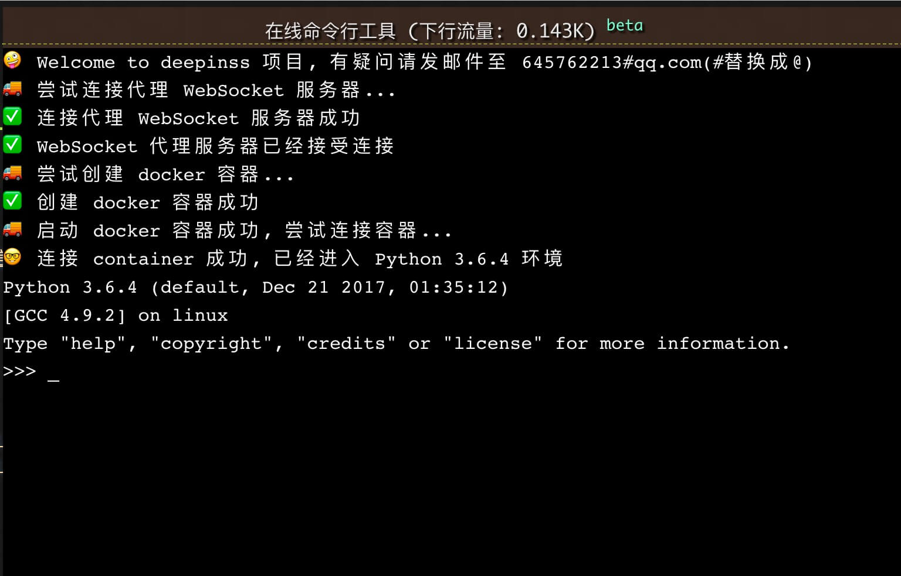
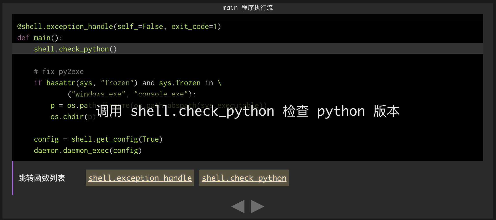

Table of Contents
==================

* [eventloop.py](/deepinss/2018/02/01/eventloop.py.html)
* [local.py](/deepinss/2018/01/31/local.py.html)
* [shell.py](/deepinss/2018/01/24/shell.py.html)
* [If you want to keep a secret, you must also hide it from yourself. 👽](/deepinss/2018/01/15/enc.html)
* [tcprelay 💌](/deepinss/2017/12/26/tcprelay.html)
* [透过 C 源码🔧深入理解 python 的 select.kqueue.control 方法](/deepinss/2017/12/23/understanding-kevent-control-method.html)
* [eventloop ♺](/deepinss/2017/12/23/eventloop.html)
* [启动🚀 local.py](/deepinss/2017/12/16/boot-local-py.html)
* [SS 的工作原理🌄](/deepinss/2017/12/14/ss-work-method.html)
* [SS 目录树🌲](/deepinss/2017/12/13/ss-directory-tree.html)

SSS
=====
 

Interpretation the source code of Shadowsocks.

[中文 README](README-zh_CN.md)

0.1.0 Released Now! 🎉🎉🎉
--------------------------------

Enable support online python environment🚀.

Introduce
---------

This project begins on December 12, 2017. Committed to making everyone understand shadowsocks source code. The project was named SSS. Understand into shadowsocks study, or study shadowsocks can be.

This project is my goal to be completed by 2018.

Features
--------

* Cover each line of code.
* Interactive interpretation code.

In development
--------------

* Online Centos environment.

Code of Conduct
---------------

* Respect original articles
* Explain every point in depth.
* Just to explore the technology.

Get Shadowsocks source code
---------------------------

[The master branch of Shadowsocks](https://github.com/shadowsocks/shadowsocks/tree/master)

Salute
------

* [github.io](https://github.io)
* [Shadowsocks](https://github.com/shadowsocks/shadowsocks)

Maintainers
-----------

* [Jiang Xuan](https://github.com/Jiang-Xuan)

